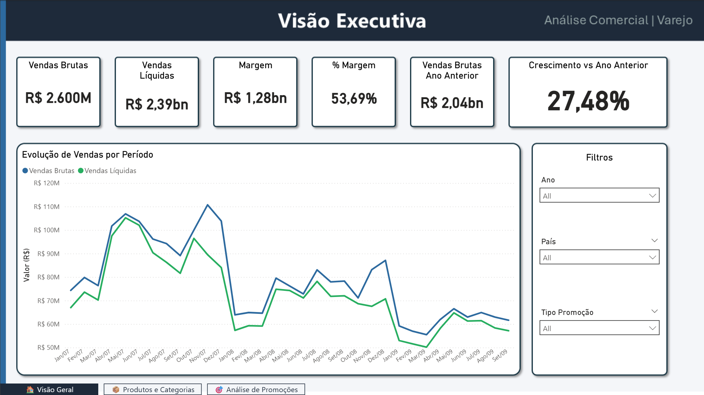
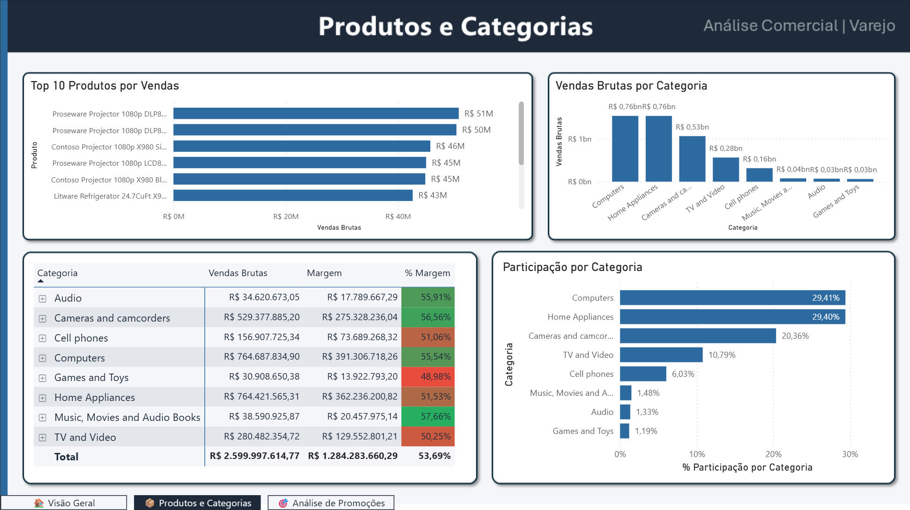
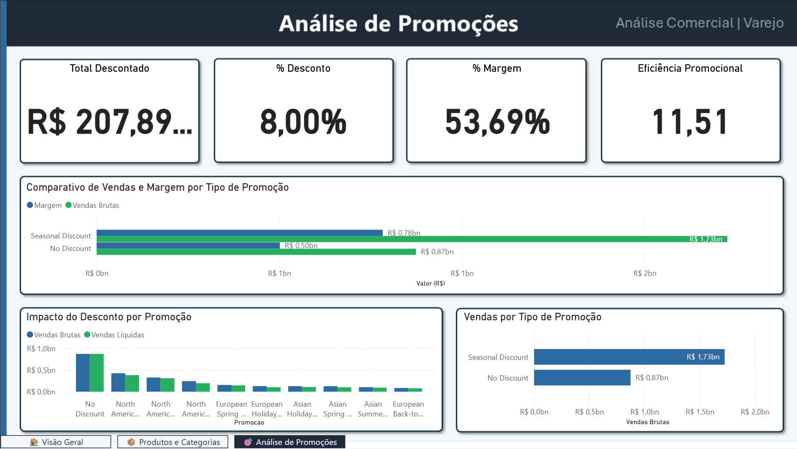

# 📊 Análise Comercial — Varejo | Power BI


> Case técnico desenvolvido para processo seletivo da **Jaar Consult (março/2026)** — análise de dados comerciais de uma empresa de varejo com foco em vendas, promoções e margem.

---
## 📸 Preview





## 📋 Índice

- [Contexto do Projeto](#-contexto-do-projeto)
- [Perguntas de Negócio](#-perguntas-de-negócio-respondidas)
- [Modelagem de Dados](#-modelagem-de-dados)
- [Medidas DAX](#-medidas-dax-desenvolvidas)
- [Segurança (RLS)](#-segurança-rls)
- [Dashboard](#-dashboard)
- [Principais Insights](#-principais-insights)
- [Tecnologias Utilizadas](#-tecnologias-utilizadas)
- [Estrutura do Repositório](#-estrutura-do-repositório)
- [Como Visualizar](#-como-visualizar)

---

## 🎯 Contexto do Projeto

Uma empresa de varejo que atua em múltiplos países, lojas e categorias de produto investe fortemente em promoções, mas não tem clareza sobre:

- Quais promoções realmente funcionam
- Quais produtos e categorias trazem mais resultado
- Se os descontos estão impactando positivamente a receita

O objetivo foi estruturar um modelo de dados robusto e um dashboard executivo que respondesse essas perguntas de forma clara e orientada a decisão.

---

## ❓ Perguntas de Negócio Respondidas

| # | Pergunta | Onde encontrar |
|---|---|---|
| 1 | Qual foi o faturamento bruto e líquido total? | Página 1 — Visão Executiva |
| 2 | Qual é a margem do negócio e como ela evoluiu? | Página 1 — Visão Executiva |
| 3 | Como as vendas evoluíram ao longo do tempo? | Página 1 — Gráfico de Linha |
| 4 | Crescemos ou encolhemos vs ano anterior? | Página 1 — KPI Crescimento vs LY |
| 5 | Quais produtos vendem mais? | Página 2 — Top 10 Produtos |
| 6 | Quais categorias têm maior participação? | Página 2 — Participação por Categoria |
| 7 | Quais categorias têm melhor e pior margem? | Página 2 — Matriz com formatação condicional |
| 8 | Quanto foi dado em desconto? | Página 3 — KPI Total Descontado |
| 9 | Qual tipo de promoção gera mais margem? | Página 3 — Margem por Tipo de Promoção |
| 10 | As promoções são eficientes financeiramente? | Página 3 — KPI Eficiência Promocional |

---

## 🗂️ Modelagem de Dados

O modelo segue a arquitetura **Star Schema** com extensão Snowflake na hierarquia de produtos.

### Tabela Fato
| Tabela | Descrição | Granularidade |
|---|---|---|
| `fVendas` | Transações de venda | 1 linha por venda |

### Tabelas Dimensão
| Tabela | Descrição |
|---|---|
| `dCalendario` | Dimensão de tempo com hierarquia completa (Ano, Mês, Dia, Semana, Trimestre) |
| `dProdutos` | Catálogo de produtos com marca, cor e classificação |
| `dCategoriaProdutos` | Categorias de produto |
| `dSubCategoriaProdutos` | Subcategorias vinculadas às categorias |
| `dLojas` | Dados das lojas (abertura, fechamento, tamanho, tipo) |
| `dLocalidades` | Dimensão geográfica (Cidade, Estado, País, Continente) |
| `dPromocoes` | Promoções com percentual de desconto, tipo e vigência |
| `dUsuarios` | Tabela auxiliar para RLS dinâmico por país |

### Diagrama de Relacionamentos

```
dCalendario (1) ──────► (*) fVendas
dProdutos   (1) ──────► (*) fVendas
dLojas      (1) ──────► (*) fVendas
dPromocoes  (1) ──────► (*) fVendas
dLocalidades(1) ──────► (*) dLojas
dCategoriaProdutos  (1) ──► (*) dSubCategoriaProdutos
dSubCategoriaProdutos(1) ─► (*) dProdutos
dUsuarios   (*) ──────► (1) dLocalidades
```

### Boas Práticas Aplicadas
- ✅ Todos os relacionamentos com cardinalidade **Many-to-One (`*:1`)**
- ✅ Direção de filtro **Single** em todo o modelo
- ✅ `dCalendario` marcada como **Tabela de Data** oficial
- ✅ Tabela `_Medidas` separada para organização das medidas DAX
- ✅ Sem relacionamentos Many-to-Many
- ✅ Sem relacionamentos bidirecionais desnecessários

---

## 📐 Medidas DAX Desenvolvidas

Todas as medidas estão centralizadas na tabela `_Medidas`, seguindo o padrão de **medidas em camadas**.

### 2.1 Métricas Principais

```dax
Vendas Brutas =
SUMX(fVendas, fVendas[PrecoUnitario] * fVendas[Quantidade])
```

```dax
Custo Total =
SUMX(fVendas, fVendas[CustoUnitario] * fVendas[Quantidade])
```

```dax
Vendas Líquidas =
SUMX(
    fVendas,
    fVendas[PrecoUnitario] * fVendas[Quantidade] *
    (1 - COALESCE(RELATED(dPromocoes[PercentualDesconto]), 0))
)
```

```dax
Quantidade Vendida =
SUM(fVendas[Quantidade])
```

### 2.2 Análise de Descontos

```dax
Valor Total de Desconto =
[Vendas Brutas] - [Vendas Líquidas]
```

```dax
% Desconto sobre Vendas Brutas =
DIVIDE([Valor Total de Desconto], [Vendas Brutas], 0)
```

### 2.3 Análise Temporal

```dax
Vendas Brutas LY =
CALCULATE([Vendas Brutas], SAMEPERIODLASTYEAR(dCalendario[Data]))
```

```dax
% Crescimento vs LY =
DIVIDE([Vendas Brutas] - [Vendas Brutas LY], [Vendas Brutas LY], 0)
```

### 2.4 Eficiência das Promoções

```dax
Margem =
[Vendas Líquidas] - [Custo Total]
```

```dax
% Margem =
DIVIDE([Margem], [Vendas Líquidas], 0)
```

### 2.5 Participação (com controle de contexto de filtro)

```dax
-- Remove filtro apenas da categoria, mantém outros filtros ativos
% Participação por Categoria =
DIVIDE(
    [Vendas Brutas],
    CALCULATE([Vendas Brutas], ALL(dCategoriaProdutos)),
    0
)
```

```dax
-- Remove todos os filtros — sempre divide pelo grand total absoluto
% Participação Total =
DIVIDE(
    [Vendas Brutas],
    CALCULATE([Vendas Brutas], ALL(fVendas)),
    0
)
```

### Medida Adicional — Eficiência Promocional

```dax
-- Para cada R$1 de desconto dado, quantos R$ de venda líquida foram gerados
Eficiência Promocional =
DIVIDE([Vendas Líquidas], [Valor Total de Desconto], 0)
```

---

## 🔐 Segurança (RLS)

Implementação de **Row Level Security dinâmico por país**, onde cada usuário visualiza apenas os dados do seu país de atuação.

### Arquitetura do RLS

```
Usuário loga com e-mail corporativo
         ↓
USERPRINCIPALNAME() captura o e-mail
         ↓
dUsuarios filtra a linha correspondente ao e-mail
         ↓
dLocalidades filtra o país do usuário
         ↓
dLojas filtra só as lojas daquele país
         ↓
fVendas exibe apenas as vendas daquelas lojas
```

### Regra DAX aplicada na tabela `dUsuarios`

```dax
[Email] = USERPRINCIPALNAME()
```

### Cobertura geográfica
O modelo cobre **34 países** incluindo: Armenia, Australia, Canada, China, France, Germany, India, Japan, United States, United Kingdom, entre outros.

---

## 📊 Dashboard

O dashboard foi estruturado em **3 páginas** com navegação por botões, cada uma respondendo um nível diferente de análise.

### Página 1 — 🏠 Visão Executiva
**Objetivo:** Visão macro para tomada de decisão rápida

**Visuais:**
- 6 KPI Cards: Vendas Brutas, Vendas Líquidas, Margem, % Margem, Vendas LY, % Crescimento vs LY
- Gráfico de linha: Evolução de Vendas Brutas vs Líquidas por período
- Filtros: Ano, País, Tipo de Promoção

### Página 2 — 📦 Produtos e Categorias
**Objetivo:** Análise de mix e performance por produto/categoria

**Visuais:**
- Top 10 Produtos por Vendas (gráfico de barras horizontal com filtro Top N)
- Vendas Brutas por Categoria (gráfico de barras vertical)
- Matriz Categoria × Subcategoria com Vendas, Margem e % Margem (formatação condicional)
- Participação % por Categoria (gráfico de barras horizontal)

### Página 3 — 🎯 Análise de Promoções
**Objetivo:** Avaliação da eficiência promocional

**Visuais:**
- 4 KPI Cards: Total Descontado, % Desconto, % Margem, Eficiência Promocional
- Margem por Tipo de Promoção (gráfico de barras clusterizado)
- Impacto do Desconto por Promoção — Vendas Brutas vs Líquidas
- Proporção de Vendas por Tipo de Promoção (100% Stacked Bar)

### Recursos Técnicos Utilizados
| Recurso | Aplicação |
|---|---|
| Background externo (PNG) | Layout profissional criado no PowerPoint |
| Tema JSON customizado | Paleta de cores corporativa consistente |
| Formatação condicional | % Margem na matriz (verde/vermelho) |
| Filtro Top N | Top 10 produtos por vendas |
| Navegação por botões | Transição entre páginas |
| Slicers dropdown | Filtros de Ano, País e Tipo de Promoção |
| RLS dinâmico | Segurança por país |

---

## 💡 Principais Insights

1. **Crescimento sólido:** As vendas brutas cresceram **+27,48%** vs ano anterior, indicando expansão consistente do negócio.

2. **Margem estável e saudável:** A % Margem se mantém em torno de **53%**, demonstrando eficiência operacional mesmo com promoções ativas.

3. **Concentração em dois segmentos:** Computers e Home Appliances representam juntos quase **60% das vendas brutas**, indicando dependência de mix — oportunidade de diversificação.

4. **Promoções eficientes:** A Eficiência Promocional de **10,18** indica que cada R$1 de desconto gerou R$10,18 de venda líquida — as promoções não estão destruindo margem.

5. **72% das vendas sem promoção:** A maior parte do volume (R$15,57M) vem de vendas sem desconto, o que sugere que a demanda orgânica é forte — promoções funcionam como acelerador, não como dependência.

6. **Seasonal Discount gera mais margem absoluta:** Com R$7,06M de margem vs R$3,42M do No Discount, as promoções sazonais são o tipo mais eficiente do portfólio.

---

## 🛠️ Tecnologias Utilizadas

- **Power BI Desktop** — Modelagem, DAX e Dashboard
- **DAX** — Medidas analíticas e RLS
- **PowerPoint** — Criação dos backgrounds das páginas
- **SQL Server** (fonte original dos dados) — ContosoRetailDW
- **GitHub** — Versionamento e publicação

---

## 📁 Estrutura do Repositório

```
powerbi-analise-comercial-varejo/
│
├── analise-comercial-varejo-powerbi.pbix   ← arquivo principal Power BI
├── README.md                               ← este arquivo
│
├── backgrounds/                            ← fundos das páginas do dashboard
│   ├── bg_pagina1.png
│   ├── bg_pagina2.png
│   └── bg_pagina3.png
│
└── prints/                                 ← screenshots do dashboard
    ├── pagina1-visao-executiva.png
    ├── pagina2-produtos-categorias.png
    └── pagina3-analise-promocoes.png
```

---

## 👁️ Como Visualizar

### Opção 1 — Power BI Desktop (recomendado)
1. Clone este repositório
2. Abra o arquivo `analise-comercial-varejo-powerbi.pbix` no Power BI Desktop
3. Os dados já estão importados — não é necessária conexão com SQL Server
4. Para testar o RLS: aba **Modeling → View as → RLS_Pais → Other user** → digite um e-mail da tabela `dUsuarios`

### Opção 2 — Visualizar pelos prints
Acesse a pasta `/prints` para ver screenshots de cada página do dashboard.

---

## 👨‍💻 Autor

Desenvolvido por Eduardo Marques como case técnico para processo seletivo — **(março/2026)**

[](https://linkedin.com/in/eagmarques)
[](https://github.com/eagmarques)

---

*Este projeto utiliza dados fictícios baseados no dataset ContosoRetailDW da Microsoft.*